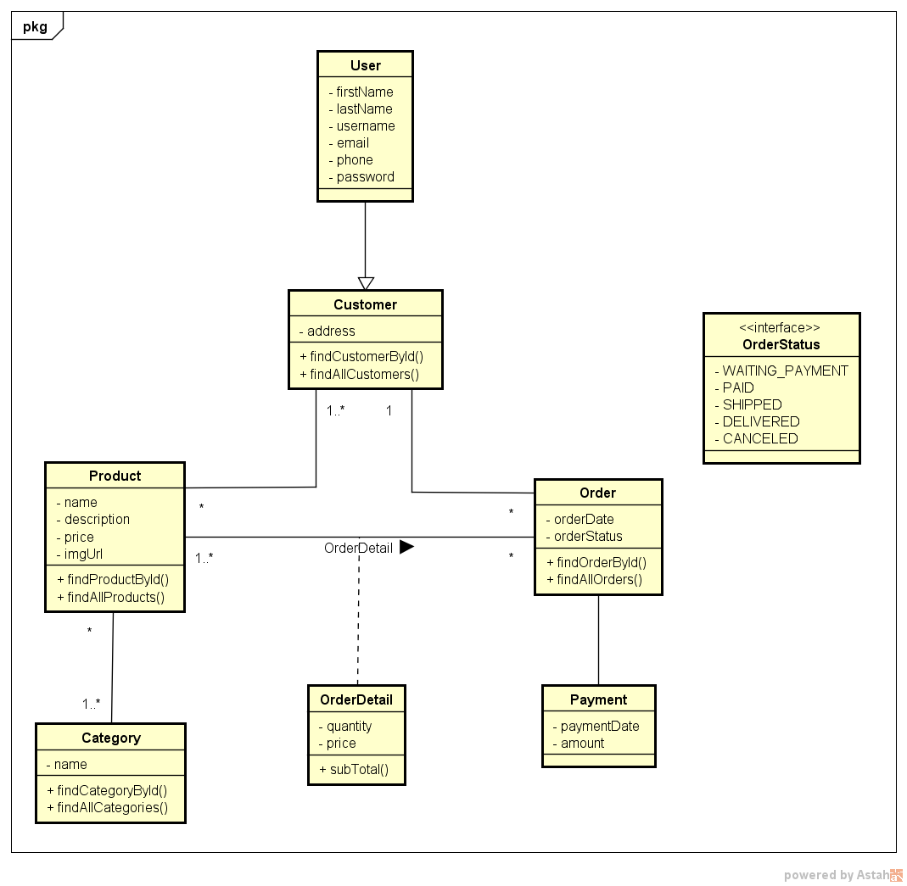

<div align="center">
  <a></a>
</div>

# SaleStream
Este projeto é um sistema básico de vendas desenvolvido em Spring Boot. O objetivo principal é demonstrar 
boas práticas de design de software, especialmente no que diz respeito ao relacionamentos de entidades e 
transferência de dados.

## Diagrama de Classe do Sistema
<div align="center">
  <a></a>
</div>

## Endpoints da Aplicação

### Customer
```markdown
GET /customer - Recupera uma lista de todos os dados.
GET /customer/{id} - Recupera uma um dado.

```
### Product
```markdown
GET /product - Recupera uma lista de todos os dados.
GET /product/{id} - Recupera uma um dado.
```

### Category
```markdown
GET /category - Recupera uma lista de todos os dados.
GET /category/{id} - Recupera uma um dado.
```

### Order
```markdown
GET /order - Recupera uma lista de todos os dados.
GET /order/{id} - Recupera uma um dado.
```

## Dependecias Utilizadas:
- spring-boot-starter-web
- spring-boot-starter-data-jpa
- h2 (com.h2database)
- spring-boot-starter-test
- mapstruct
- lombok
